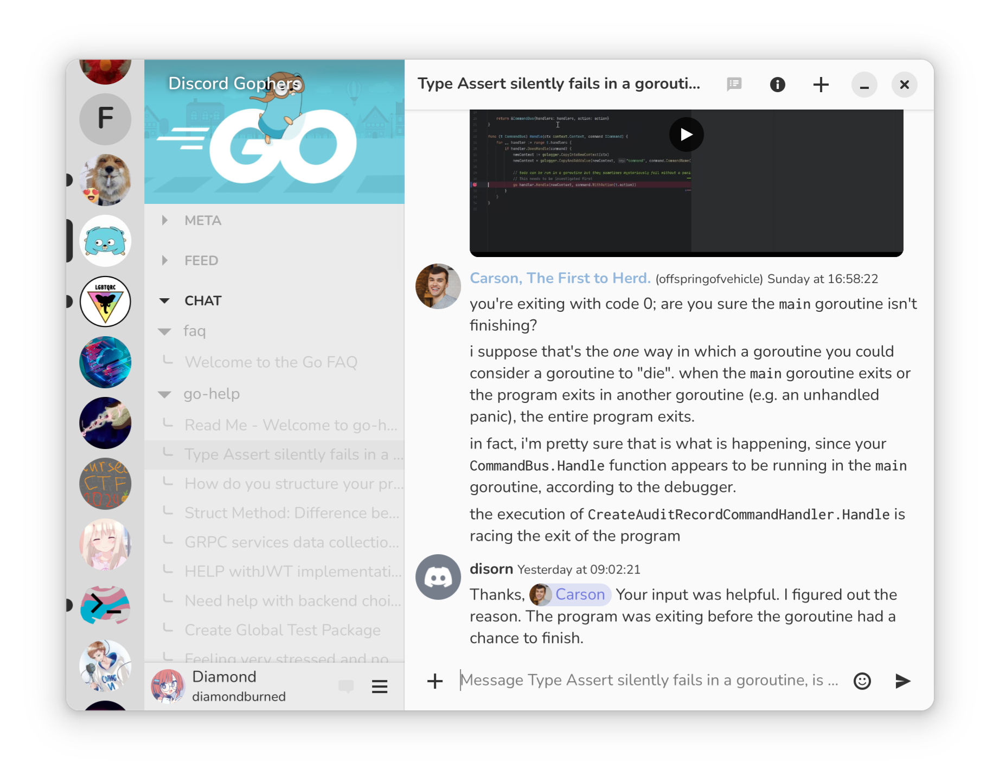

<div align="center">


<h1>Dissent</h1>

</div>

[](https://goreportcard.com/report/github.com/diamondburned/dissent)
[](https://repology.org/project/dissent/versions)


[](https://github.com/diamondburned/dissent/deployments/Nightly%20release)
[](https://github.com/diamondburned/dissent/deployments/Stable%20release)


<br>

<p>
  Dissent (formerly gtkcord4) is a third-party Discord client designed for a
  smooth, native experience on Linux desktops.

  Built with the GTK4 toolkit for a modern look and feel, it delivers your
  favorite Discord app in a lightweight and visually appealing package.
</p>

<div align="center">



<div>
  <a href="./.github/screenshots/03.png"></a>
  <a href="./.github/screenshots/01.png"></a>
  <a href="./.github/screenshots/02.png"></a>
  <a href="./.github/screenshots/04.png"></a>
</div>

</div>

> [!NOTE]
> Using an unofficial client at all is against Discord's Terms of Service and
> may cause your account to be banned! While Dissent tries its best to not use
> the REST API at all unless necessary to reduce the risk of abuse, it is still
> possible that Discord may ban your account for using it. **Please use at your
> own risk!**

## Installation

### Dependencies

Dissent needs GTK4, gobject-introspection, and optionally libcanberra. If compiling, then the library
headers are also required.

### Pre-built Binary

Dissent's CI automatically builds each release for the following platforms:

- Linux x86_64
- Linux aarch64
- Windows x86_64

See the [Releases](https://github.com/diamondburned/dissent/releases) page for
the binaries.

### Distribution Packages

Dissent is available in the following distributions:

<a href="https://repology.org/project/dissent/versions">
    
</a>

### Flatpak

Dissent is available on Flathub:

[](https://flathub.org/apps/details/so.libdb.dissent)

<a href="https://flathub.org/apps/details/so.libdb.dissent">
    
</a>

### Compiling

You need Go 1.18+ for this step.

To compile from scratch, run

```sh
go install -v libdb.so/dissent@latest
```

## Logging In

To log into Dissent, you need to get your user token:

1. Open the Discord web app in your browser and log in.
2. Press <kbd>F12</kbd> to open the Inspector.
3. Go to the Network tab then press <kbd>F5</kbd> to refresh the page.
4. In the 'Filter URLs' text box, search `discord api`.
5. Click on any HTTP message entry and inspect its message headers. Under
   the 'Request Headers' section, search for the `Authorization` header.
6. Copy its value (the token) into the Token field, then click Login.

> [!WARNING]
> Logging in using username/email and password is strongly discouraged. This
> method is untested and may cause your account to be banned! Prefer using the
> token method above.
